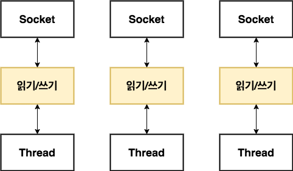
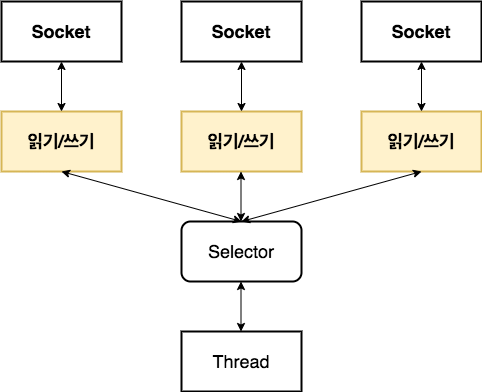

# 01 네티: 비동기식 이벤트 기반 네트워킹 프레임워크

>netty  
네티는 유지 관리가 용이한 고성능 프로토콜 서버와 클라이언트를 신속하게 개발하기 위한 비동기식 이벤트 기반 네트워크 애플리케이션 프레임워크다.

단지 위의 내용을 보고 초보 개발자가 네티를 이용하여 고성능 시스템을 만드는 것은 쉽지 않은 일인데, 고성능 시스템은 단순히 높은 수준의 코딩 기술 뿐만이 아니라 네트워킹, 멀티스레딩, 동시성을 비롯한 여러 복잡한 분야에 대한 전문 기술을 필요로 하기 때문이다. 네티는 이 도메인 지식을 네트워킹 초심자도 이용할 수 있게 한 곳으로 모았다.

이 책의 목표는 최대한 다양한 개발자가 네티를 접할 수 있게 한다는 것이다. 여기에는 혁신적인 콘텐츠나 서비스를 제공할 역량은 있지만 네트워킹 전문가가 되기 위한 시간이나 굳이 그럴 필요가 없는 개발자를 포함한다. 다른 한편으로는 직접 네트워크 프로토콜을 제작하기 위한 툴을 찾는 수준 높은 전문가를 지원하는데도 초점을 맞춘다.

네티는 궁극적으로 프레임워크이며, 기술적 내용에 못지않게 아키텍처상의 접근법이나 설계 원칙도 중요한 요점이다.
- 관심사의 분리(비즈니스 논리와 네트워크 논리의 분리)
- 모듈성과 재사용성
- 테스트 용이성을 우선 요건으로 취급

## 1.1 자바의 네트워킹 
자바 초기(1995 ~ 2002)부터 까다로운 세부사항을 감추기 위한 객체지향 파사드가 적지않게 선보였지만, 복잡한 클라이언트/서버 프로토콜을 제작하려면 여전히 많은 양으이 보일러플레이트 코드를 작성해야 하고, 모든 사항이 매끄럽게 작동하게 하려면 틈틈이 내부를 들춰봐야 했다.

이러한 최초의 자바 API(java.net)는 네이티브 시스템 소켓 라이브러리가 제공하는 이른바 블로킹 함수만 제공했다.

하지만, 이 방식은 다음과 같은 문제점이 있따.
1. 여러 스레드가 입력이나 출력 데이터가 들어오기를 기다리며 무한정 대기상태로 유지될 수 있다. 이것은 리소스의 낭비로 이어질 가능성이 높다.
2. 각 스레드가 스택 메모리를 할당해야 하는데, 운영체제에 따라 다르지만 스택의 기본 크기는 64KB에서 1MB까지 차지할 수 있다.
3. JVM이 물리적으로 아주 많은 수의 스레드를 지원할 수 있지만, 동시 접속이 한계에 이르기 훨씬 전부터 (ex: 1만개 수준) 컨텍스트 전환에 따른 오버헤드가 문제가 될 수 있다.

이에대한 더 나은 방법으로 JAVA NIO가 등장..

### 1.1.1 자바  NIO
블로킹 시스템 호출 방식 외에도 네이티브 소켓 라이브러리에는 오래전부터 네트워크 리소스 사용률을 세부적으로 제어할 수 있는 논블로킹 호출이 포함되어 있따.
- setsockopt()를 사용하면 데이터가 없을 떄, 즉 블로킹 호출이라면 진행을 블로킹할 상황에서 읽기/쓰기 호출이 즉시 반환하도록 소켓을 구성할 수 있다. 
- 시스템의 이벤트 통지 API를 이용해 논블로킹 소켓의 집합을 등록하면 읽거나 기록할 데이터가 준비됐는지 여부를 알 수 있다.

논블로킹 입출력을 위한 자바 기능은 2002년 JDK 1.4 패키지인 java.nio와 함께 도입되었다.

### 1.1.2  셀렉터

논블로킹 설계를 보면 블로킹 방식의 단점이 사실상 완전히 해결된 것을 볼 수 있다.

java.nio.channels.Selector클래스는 자바의 논블로킹 입출력 구현의 핵심으로서, 논블로킹 Socket의 집합에서 입출력이 가능한 항목을 지정하기위해 이벤트 통지 API를 이용한다. 언제든지 읽거나 쓰기 작업의 완료 상태를 확인할 수 있으므로 그림에서 나오는 것처럼 한 스레드로 여러 동시 연결을 처리할 수 있다.
- 적은 수의 스레드로 더 많은 연결을 처리할 수 있으므로 메모리 관리와 컨텍스트 전환에 따르는 오버헤드가 감소한다.
- 입출력을 처리하지 않을 때는 스레드를 다른 작업에 활용할 수 있다.

그러나 자바 NIO를 직접 사용하여 안전하게 코드를 짜기가 매우 어렵다고 한다.(직접 Selector 등을 이용해서 코드를 작성해보려고 하니 확실히 많은 코드를 작성해야 했었다.) 

---

## 1.2 네티 소개 

수십만의 동시 사용자를 지원하기 위해 더 높은 수준의 처리량과 규모 가변성을 더 낮은 비용으로 구현하는 것은 언제나 가장먼저 손꼽히는 요인이다.

저수준 API를 직접 이용하면 복잡성이 심화되며, 구하기 어려운 특수한 고급 인력에 대한 의존성이 높아진다는 사실을 그간의 길고 고통스러운 경험을 통해 알고 있따. 따라서 기반 구현의 복잡성을 단순한 추상화로 감추는 객체 지향의 기본 개념을 도입해야 한다.

이 기본 원칙은 특히 분산 시스템 개발 분야에서 공통적인 프로그래밍 작업을 위한 솔루션을 캡슐화하는 다양한 프레임워크의 개발 동기가 됐다. 전문 자바 개발자라면 적어도 이러한 하나 이상의 프레임워크에 익숙하다고 가정해도 좋을 것이다. 이러한 프레임워크는 기술 요건과 개발 일정을 충족하는 데 없어서는 안되는 중요한 도구로 자리잡았다.

네티의 특징요약
|범주|네티의 특징|
|---|---|
|설계|단일 API로 블로킹과 논블로킹 방식의 여러 전송 유형을 지원. 단순하지만 강력한 스레딩 모델. 진정한 비연결 데이터그램 소켓 지원. 재사용 지원을 위한 논리 컴포넌트 연결|
|이용 편이성|자세한 Javadoc과 광범위한 예제. JDK 1.6+을 제외한 추가 의존성 없음.
|성능|코어 자바 API보다 높은 처리량과 짧은 지연 시간. 풀링과 재사용을 통한 리소스 소비 감소, 메모리 복사 최소화|
|견고성|저속, 고속 또는 과부하로 인한 OOM가 발생하지 않음. 고속 네트워크 상의 NIO 애플리케이션에서 일반적인 읽기/쓰기 비율 불균형이 발생하지 않음
|보안| 완벽한 SSL/TLS 및 StartTLS 지원. 애플릿이나 OSGi 같은 제한된 환경에서도 이용 가능
|커뮤니티 주도 개발| 빨리 그리고 자주 릴리스됨| 

### 1.2.1 네티는 누가 사용할까

- 애플
- 트위터
- 페이스북
- 구글
- 스퀘어
- 인스타그램
- HornetQ
- Vert.x
- 엘라스틱서치 등등

### 1.2.2 비동기식 이벤트 기반 네트워킹

비동기, 즉 동기화 되지 않은 이벤트의 예로는 이메일이 있따. 보낸 메시지의 답장이 올수도 있지만 답장이 없는 경우도 있고, 메시지르 보내는 동안 예기치 않은 메시지를 받을 수도 있다.

본질적으로 비동기식과 이벤트 기반 특징을 모두 갖는 시스템은 특수하고도 동시에 극히 유용한 행동 유형을 보여주는데, 바로 발생하는 이벤트에 대해 언제든지, 그리고 순서에 관계없이 응답할 수 있다는 것이다.

이러한 특징은 "증가하는 작업량에 맞게 적절히 처리할 수 있는 시스템, 네트워크, 프로세스의 능력 또는 이러한 작업량 증가에 맞게 규모를 늘리는 능력" 이라고 정의되는 최고 수준의 확장성을 실현하는데 필수적이다.

- 논블로킹 네트워크 연결은 작업 완료를 기다릴 필요가 없게 해준다. 완전 비동기 입출력은 이 특징을 바탕으로 한 단계 더 나아간다. 비동기 메소드는 즉시 반환하며 작업이 완료되면 직접 또는 나중에 이를 통지한다.

- 셀렉터는 적은 수의 스레드로 여러 연결에서 이벤트를 모니터링 할 수 있게 해준다.

## 1.3 네티의 핵심 컴포넌트

- Channel
- 콜백
- Future
- 이벤트와 핸들러

### 1.3.1 Channel
하나이상의 입출력작업을 수행할 수 있는 하드웨어 장치, 파일, 네트워크 소켓, 프로그램 컴포넌트와 같은 엔티티에 대한 열린 연결

### 1.3.2 콜백
다른 메소드로 자신에 대한 참조를 제공할 수 있는 메소드. 다른 메소드에서는 이 참조가 가리키는 메소드를 필요할 떄 호출할 수 있따. 콜백은 광범위한 프로그래밍 상황에 이용되며 관심 대상에게 작업 완료를 알리는 가장 일반적인 방법 중 하나이다.

### 1.3.3 Future
작업이 완료되면 이를 애플리케이션에 알리는 한 방법이다. 비동기 객체의 작업 결과를 담는 자리표시자 역할을 하며, 미래의 어떤 시점에 작업이 완료되면 그 결과에 접근할 수 있게 해준다.

네티의 모든 아웃바운드 입출력 작업은 ChanelFuture를 반환하며 진행을 블로킹하는 작업은 없다. 앞서 언급한대로 네티는 기본적으로 비동기식이며 이벤트 기반이다.

### 1.3.4 이벤트와 핸들러

네티는 작업의 상태 변화를 알리기 위해 고유한 이벤트를 이용하며, 발생한 이벤트를 기준으로 적절한 동작을 트리거할 수 있다.
- 로깅
- 데이터변환
- 흐름제어
- 애플리케이션 논리

네티는 프레임워크이므로 이벤트 역시 인바운드 또는 아웃바운드 데이터 흐름에 대한 연관성을 기준으로 분류된다. 인바운드 데이터나 연관된 상태로 변화로 트리거되는 이벤트는 다음을 포하한다.
- 연결 활성화 또는 비활성화
- 데이터 읽기
- 사용자 이벤트
- 오류 이벤트

아웃바운드 이벤트는 다음과 같이 미래에 한 동작을 트리거하는 작업의 결과다.
- 원격 피어로 연결 연결 또는 닫기
- 소케승로 데이터 쓰기 또는 플러시

