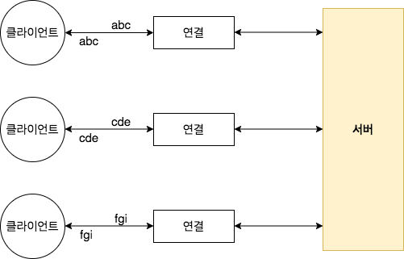

# 첫 번째 네티 애플리케이션 

이번 장에서는 네티 기반 클라이언트와 서버를 만드는 과정을 다룬다고 한다. 이 예제 애플리케이션은 클라이언트가 서버로 메시지를 전송하면 서버가 이 메시지를 반향 출력하는 간단한 예제이다.

이 예제를 통해 다음의 효과를 얻을 수 있다.
1. 개발 툴과 환경을 설정하고 확인하는 시험대를 만들 수 있다.
2. 1장에서 소개한 네티의 핵심 요소인 ChannelHandler를 이용해 애플리케이션의 논리를 구축하는 과정을 체험할 수 있다.

내 환경
- 자바 : open_jdk 1.8
- IDE : 인텔리제이
- 빌드툴 : Gradle

책에서는 메이븐을 쓴다고 하나, 평소 내가 작업하는 그레이들이므로 그레이들로 작업을 진행하도록 한다. 

## 네티 클라이언트 / 서버 개요

다수의 클라이언트가 동시에 서버로 연결되는 것을 볼 수 있다. 지원되는 클라이언트의 수는 이론상으로 이용 가능한 시스템 리소스의 양과 JDK 버전에 따른 제약 조건에 의해서만 제한된다.

## Echo 서버 만들기
모든 네티 서버에는 다음 항목이 필요하다.
- 하나 이상의 ChannelHandler : 이 컴포넌트는 클라이언트로부터 받은 데이터를 서버측에서 처리하는 비즈니스 논리를 구현한다.
- 부트스트랩 : 서버를 구성하는 시동 코드를 의미한다. 최소한 서버가 연결 요청을 수신하는 포트를 서버와 바인딩하는 코드가 있어야 한다.

### ChannelHandler와 비즈니스 논리

Echo서버는 들어오는 메시지에 반응해야 하므로 인바운드 이벤트에 반응하는 메서드가 정의된 ChannelInboundHandler 인터페이스를 구현해야 한다. 이 애플리케이션은 소수의 메서드를 이용하는 간단한 애플리케이션으로 ChannelInboundHandler의 기본 구현을 제공하는 ChannelInboundHandlerAdapter의 하위 클래스를 만드는 것으로 충분하다.

관심을 가질메서드는 다음과 같다.
- channelRead() : 메시지가 들어올 때마다 호출된다.
- channelReadComplete() : channelRead()의 마지막 호출에서 현재 일괄 처리의 마지막 메시지를 처리했음을 핸들러에 통보한다.
- exceptionCaught() : 읽기 작업 중 예외가 발생하면 호출된다.

 > 예외를 포착하지 않으면 어떻게 될까?  
 모든 Channel에는 ChannelHandler 인스턴스의 체인을 포함하는 ChannelPipeline이 연결되어 있다. 기본적으로 핸들러는 체인상의 다음 항목으로 핸들러 메서드의 호출을 전달한다. 즉 체인의 어디에서도 exceptionCaught()이 구현되지 않은 경우 수신된 예외가 ChannelPipeline의 끝까지 이동한 후 로깅된다. 따라서 애플리케이션에서 exceptionCaught()를 구현하는 ChanelHandler를 하나 이상 제공하는 것이 바람직하다.

 - ChannelHandler는 네 가지 이벤트 유형에 의해 호출된다.
 - 애플리케이션은 ChannelHandler를 구현하거나 확장해 이벤트 수명주기를 후크하고 커스텀 애플리케이션 논리를 제공한다.
 - 아키텍처 관점에서 ChannelHandler는 비즈니스 논리를 네트워킹 코드로부터 분리하도록 도와준다. 결과적으로 변경에 맞게 코드를 발전시키는 개발 과정이 간소화된다.

 ### 서버 부트스트랩

 이번엔 서버의 부트스트랩이다.
 - 서버가 수신할 포트를 바인딩하고 들어오는 연결 요청을 수락한다.
 - EchoServerHandler 인스턴스에 인바운드 메시지에 대해 알리도록 Channel을 구성한다.

## Echo 클라이언트 만들기
Echo 클라이언트는 다음과 같은 일을 한다.
1. 서버로 연결한다.
2. 메시지를 하나 이상 전송한다.
3. 메시지마다 대기하고 서버로부터 동일한 메시지를 수신한다.
4. 연결을 닫는다.

### ChannelHandler를 이용한 클라이언트 논리 구현
- channelActive() : 서버에 대한 연결이 만들어지면 호출된다.
- channelRead0() :  서버로부터 메시지를 수신하면 호출된다.
- channelexceptionCaught() : 처리중에 예외가 발생하면 호출된다.

