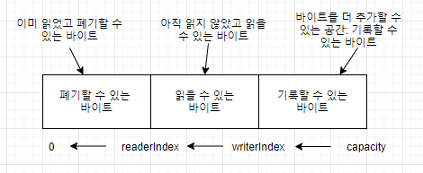
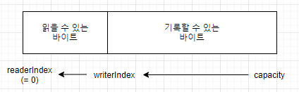

# ByteBuf

자바 NIO는 ByteBuffer라는 자체 바이트 컨테이너를 제공하지만 이 클래스는 사용하기 부담스럽다. 

네티에서는 ByteBuffer를 JDK API의 제약을 해결하고 네트워크 애플리케이션 개발자에게 더 나은 API를 제공하는 강력한 구현인 ByteBuf가 있다.

ByteBuf를 알아가는 과정에서 ChannelPipeline과 ChannelHandler를 집중적으로 살펴보기 위한 지식을 쌓을 수 있다.

## 5.1 ByteBuf API
네티는 데이터 처리를 위한 API를 ByteBuf 추상 클래스와 ByteBufHolder 인터페이스라는 두 컴포넌트를 통해 노출한다. 

ByteBuf의 장점
- 사용자 정의 버퍼 형식으로 확장할 수 있음
- 내장 복합 버퍼 형식을 통해 투명한 제로 카피를 달성할 수 있음
- 용량을 필요에 따라 확장할 수 있음 (JDK의 StringBuilder와 비슷함)
- ByteBuffer의 flip() 메서드 호출 없이도 리더와 라이터 모드를 전환할 수 있음
- 읽기와 쓰기에 고유 인덱스를 적용함.
- 메서드 체인이 지원됨
- 참조 카운팅이 지원됨
- 풀링이 지원됨

## 5.2 ByteBuf 클래스 : 네티의 데이터 컨테이너
모든 네트워크 통신은 까다로운 바이트의 시퀀스를 주고 받는 방식으로 이뤄지므로 효율적이고 사용하기 쉬운 데이터 구조가 반드시 필요하다. 네티의 ByteBuf 구현을 통해 이러한 요건을 충족시킬 수 있따.

### 5.2.1 작동 방식
ByteBuf는 읽기와 쓰기를 위한 고유의 두 인덱스를 유지한다. ByteBuf에서 데이터를 읽으면 ByteBuf의 readerIndex가 읽은 바이트 수만큼 증가한다. 비슷하게 ByteBuf에 데이터를 기록하면 writerIndex가 증가한다.

ByteBuf 메서드 중 이름이 read나 write로 시작하는 메서드는 해당 인덱스를 증가시키지만, 이름이 set이나 get으로 시작하는 메서드는 인덱스를 증가시키지 않으며, 메서드의 인수로 전달한 상대 인덱스를 기준으로 작업한다.

ByteBuf의 최대 용량을 지정할 수 있지만 쓰기 인덱스를 용량보다 크게 지정하려고 하면 예외가 트리거 된다.

### 5.2.2 ByteBuf 사용 패턴

**힙버퍼**  
가장 자주 이용되는 ByteBuf 패턴, JVM의 힙 공간에 데이터를 저장한다. 이 패턴은 풀링이 사용되지 않는 경우 빠른 할당과 해제 속도를 보여준다.  

**다이렉트 버퍼**  
객체용으로 할당되는 메모리는 힙에서만 가져올 수 있다고 생각하기 쉽지만 반드시 그런 것은 아니다. JDK 1.4에서 NIO와 함께 도입된 ByteBuffer 클래스는 JVM 구현이 네이티브 호출을 통해 메모리를 할당하도록 허용한다. 이것은 네이티브 입출력 작업을 호출하기 전(또는 후)에 버퍼의 내용을 중간 버퍼로(또는 반대로) 복사하지 않게 하기 위한 것이다.

ByteBuffer의 Javadoc을 보면 "다이렉트 버퍼의 내용은 일반적인 가비지 컬렉션이 적용되는 힙 바깥에 위치한다"라고 명시하고 있다. 다이렉트 버퍼가 네트워크 데이터 전송에 이상적이기 때문이다. 데이터가 힙 할당 버퍼에 있는 경우 JVM은 소켓을 통해 전송하기 전에 내부적으로 버퍼를 다이렉트 버퍼로 복사해야 한다.

다이렉트 버퍼의 주요 단점은 힙 기반 버퍼보다 할당과 해제의 비용 부담이 약간 더 크다는 것이다. 또한 레거시 코드를 이용하는 경우 다른 단점을 경험할 수 있는데, 데이터가 힙에 있지 않기 떄문에 다음 예제에 나오는 것처럼 복사본을 만들어야 한다.

**복합 버퍼**
이 패턴에서는 ByteBUf 인스턴스를 필요에 따라 추가 및 삭제할 수 있다. JDK의 ByteBuffer 구현에는 이와 비슷한 기능이 없다.
네티는 여러 버퍼가 병합된 가상의 단일 버퍼를 제공하는 ByteBuf의 하위 클래스인 CompositeByteBuf를 이용해 이 패턴을 구현한다.

헤더와 본문의 두 부분으로 구성되는 메시지를 HTTP를 통해 전송하는 경우를 예로 들어보자. 두 부분은 애플리케이션의 각기 다른 모듈에서 생성되며, 메시지를 전송할 때 조립된다. 애플리케이션에는 동일한 메시지 본문을 여러 메시지에 재사용하는 옵션이 있으며, 이 옵션을 이용하는 경우 각 메시지에 새로운 헤더가 생성된다.

CompositeByteBuf를 이용하면 메시지마다 두 버퍼를 다시 할당할 필요가 없어 아주 편리하며, 공통 ByteBuf APi를 노출할 떄 불필요하게 복사할 필요가 없게 해준다. 

*ByteBuf를 이용한 복합 버퍼 패턴*
```
// 배열을 이용해 메시지 부분을 저장
ByteBuffer[] message = new ByteBuffer[] {header, body};
// 새로운 ByteBuffer를 생성하고 헤더와 본문을 복사해 병합
ByteBuffer message2 = ByteBuffer.allocate(header.remaining() + body.remaining());
message2.put(header);
message2.put(body);
message2.flip();
```
위의 방식은 할당과 복사 작업을 해야하고 배열을 관리해야 하는 부담까지 있어 비효율 적이고 불편한다.

*CompositeByteBuf를 이용하는 복합 버퍼 패턴*
```
CompositeByteBuf messageBuf = Unpooled.compositeBuffer();
ByteBuf headerBuf = ...; // 보조 또는 다이렉트일 수 있음
ByteBuf bodyBuf = ...; // 보조 또는 다이렉트일 수 있음
messageBuf.addComponents(headerBuf, bodyBuf);
....
messageBuf.removeComponent(0); // 헤더를 제거
for (ByteBuf buf : messageBuf) {
    System.out.println(buf.toString());
}
```
CompositeByteBuf는 보조 배열에 대한 접근을 허용하지 않을 수 있으므로 CompositeByteBuf의 데이터에 접근하려면 다음과 같이 다이렉트 버퍼 패턴과 비슷한 방법을 이용한다.

```
CompositeByteBuf compBuf = Unpooled.compositeBuffer();
int length = compBuf.readableBytes(); // 읽을 수 있는 바이트를 얻음
byte[] array = new byte[length]; // 읽을 수 있는 바이트 길이만큼 새 배열을 할당
compBuf.getBytes(compBuf.readerIndex(), array); // 배열로 바이트를 읽음
handleArray(array, 0, array.length); // 오프셋과 길이 매개변수로 배열을 이용
```
네티는 CompositeByteBuf를 이용하는 소켓 입출력 작업을 최적화해 JDK의 버퍼 구현이 이용될 떄 발생하는 성능과 메모리 소비 패널티를 최소화한다. 이 최적화는 네티의 핵심 코드에서 수행되므로 드러나지 않지만 그 영향을 알고 있는 것이 좋다.

## 5.3 바이트 수준 작업
ByteBuf는 기본 읽기와 쓰기 작업 외에도 데이터를 수정하는 데 이용할 수 있는 다양한 메서드를 제공한다. 

### 5.3.1 임의 접근 인덱싱
일반 자바 바이트 배열과 마찬가지로 ByteBuf 인덱싱도 0 기반이므로 첫 번째 바이트의 인덱스는 0이고, 마지막 바이트의 인덱스는 capacity() - 1 이다. 
```
ByteBuf buf = ...;
for (int i = 0; i < buf.capacity(); i++)
{
    byte b = buffer.getByte(i);
    System.out.println((char) b);
}
```
인덱스 인수를 받아 데이터에 접근하는 메서드는 readerIndex나 writerIndex의 값을 변경하지 않느다. 필요한 경우 readerIndex(index)나 writerIndex(index)를 호출해 이러한 인덱스 값을 수동으로 변경할 수 있다.


### 5.3.2 순차 접근 인덱싱
ByteBuf에는 읽기와 쓰기 인덱스가 모두 있지만 JDK ByteBuffer에는 인덱스가 하나만 있으므로 읽기와 쓰기 모드를 전환하기 위해 flip()을 호출해야 한다.



### 5.3.3 폐기할 수 있는 바이트
폐기할 수 있는 바이트로 표시된 세그먼트는 이미 읽은 바이트를 포함한다. discardReadBytes()를 호출하면 이 공간을 폐기하고 공간을 회수할 수 있다. readerIndex에 저장된 이 세그멘트의 처음 크기는 0이며, 읽기 작업을 실행하면 증가한다.



discardReadBytes()를 자주 호출해기록할 수 있는 세그먼트를 최대한 크게 유지하면 좋을 것 같지만 이렇게 하려면 읽을 수 있는 바이트를 버퍼의 시작 부분으로 옮기기 위해 메모리 복사를 해야 한다는 점을 알아야 한다.  메모리가 아주 중요한 경우와 같이 꼭 필요할 때만 discardReadBytes()를 호출하는 것이 좋다.

### 5.3.4 읽을 수 있는 바이트
ByteBuf의 읽을 수 있는 바이트 세그먼트에는 실제 데이터가 저장된다. 새로 할당, 래핑 또는 복사된 버퍼에서 readerIndex의 기본값은 0이다. 이름이 read나 skip으로 시작하는 모든 작업은 현재 readerIndex 위치에 있는 데이터를 읽거나 건너뛰며, 읽은 바이트 수만큼 readerIndex를 증가시킨다.

```
ByteBuffer buf = ...;
while (buf.isReadable())
{
    System.out.println(buffer.readByte());
}
```


### 5.3.5 기록할 수 있는 바이트
기록할 수 있는 바이트 세그먼트는 정의되지 않은 내용이 들어 있고 기록할 수 있는 영역이다. 새로 할당된 버퍼의 writerIndex 기본값은 0이다. 이름이 write로 시작하는 모든 작업은 현재 writerIndex 위치부터 데이터를 기록하며, 기록한 바이트 수만큼 writerIndex를 증가시킨다. 

```
ByteBuf byteBuf = ...;
while (byteBuf.writableBytes() >= 4)
{
    byteBuf.writeInt(random.nextInt());
}
```

### 5.3.6 인덱스 관리
JDK의 InputStream은 mark(int readlimit)와 reset() 메서드를 정의한다. 이 두 메서드는 각각 스트림의 현재 위치를 지정한 값으로 표시하거나 스트림을 해당 위치로 재설정한다.

이와 비슷하게 ByteBuf의 readerIndex와 writerIndex를 설정 및 재설정하는 데는 amrkReaderIndex()와 markWriterIndex(), 그리고 resetReaderIndex()와 resetWriterIndex() 메서드를 이용할 수 있따. 이들 메서드는 InputSteram의 메서드와 비슷하지만 표시가 무효화 된다는 조건을 지정하는 readLimit 매개변수가 없다.

clear()를 호출할 경우 writerIndex, readerIndex의 index가 0이 된다.

### 5.3.7 검색 작업
ByteBuf 안에서 지정한 값의 인덱스를 알아내는 몇 가지 방법이 있다. 가장 간단한 방법은 indexOf() 메서드를 이용하는 것이며, ByteBufProcessor 인수를 받는 메서드를 이용하면 더 복잡한 검색을 할 수 있다. 이 인터페이스는 메서드 하나를 저의한다.

boolean process(byte value)

이 메서드는 입력 값이 찾은 값인지 여부를 보고한다.

ByteBufProcessor에는 일반적인 값을 대상으로 작업하는 여러 편의성 메서드가 있다. 예를 들어, 애플리케이션에서 NULL로 종료되는 콘텐츠가 들어 있는 플래시 소켓을 통합해야 하는 경우 다음과 같이 호출할 수 있다.

forEachByte(ByteBufProcessor.FIND_NUL)
이 방식을 이용하면 처리 중 바운드 검사를 적게 수행할 수 있어 플래시 데이터를 간단하고 효율적으로 소비할 수 있따.
다음 예제는 캐리지 문자 (\r)를 검색하는 방법이 나온다.
```
ByteBuf buf = ...;
int index = buf.forEachByte(ByteBufProcessor.FIND_CR);
```

### 5.3.8 파생 버퍼
파생 버퍼는 ByteBuf의 내용을 특수한 방법으로 나타내는 뷰를 제공한다. 다음의 여러 메서드로 인한 뷰를 생성할 수 있다.
- duplicate()
- slice()
- slice(int, int)
- Unpooled.unmodifiableBuffer(...)
- order(ByteOrder)
- readSlice(int)

각 메서드는 읽기와 쓰기, 그리고 표시 인덱스를 포함하는 새로운 ByteBuf 인스턴스를 반환한다. 파생 버퍼의 내부 저장소는 JDK ByteBuffer와 마찬가지로 공유된다. 즉, 생성하는 비용은 낮지만 파생 버퍼의 내용을 수정하면 원본 인스턴스까지 수정된다는 데 주의해야 한다.

> ByteBuf의 복사
기존 버퍼의 복사본이 필요하다면 copy()나 copy(int, int)를 이용하면 된다. 파생 버퍼와는 달리 이 메서드에서 반환하는 ByteBuf는 데이터의 독립된 복사본이다.

*ByteBuf의 슬라이스 만들기*
```
Charset utf8 = Charset.forName("UTF-8");
ByteBuf buf = Unpooled.copiedBuffer("Netty in action!", utf8);
ByteBuf sliced = buf.slice(0, 14);
System.out.println(sliced.toString(utf8));
buf.setByte(0, (byte)'J');
assert buf.getByte(0) == sliced.getByte(0);
```

*ByteBuf의 복사본 만들기*
```
Charset utf8 = Charset.forName("UTF-8");
ByteBuf buf = Unpooled.copiedBuffer("Netty in action!", utf8);
ByteBUf copy = buf.copy(0,14);
System.out.println(copy.toSTring(utf8));
buf.setByte(0, (byte)'J');
assert buf.getByte(0) != copy.getByte(0);
```


### 5.3.9 읽기/쓰기 작업 

읽기/쓰기 작업은 두 가지 범주가 있따.
- get() 및 set() 작업은 지정한 인덱스에서 시작하며 인덱스를 변경하지 않는다.
- read() 및 write() 작업은 지정한 인덱스에서 시작하며 접근한 바이트 수만큼 인덱스를 증가시킨다.

*get() 작업*
|이름|설명|
|---|---|
|getBoolean(int)|지정한 인덱스의 Boolean 값을 반환|
|getByte(int)|지정한 인덱스의 바이트를 반환|
|getUnsignedByte(int)|지정한 인덱스의 부호 없는 바이트 값을 short로 반환|
|getMedium(int)|지정한 인덱스의 24비트 미디엄 int 값을 반환|
|getUnsignedMedium(int)|지정한 인덱스의 부호없는 24비트 미디엄 int 값을 반환
|getInt(int)|지정한 인덱스의 int값을 반환|
|getUnsignedInt(int)|지정한 인덱스의 부호 없는 int 값을 long으로 반환|
|getLong(int)|지정한 인덱스의 long 값을 반환|
|getShort(int)|지정한 인덱스의 short 값을 반환|
|getUnsignedShort(int)|지정한 인덱스의 부호없는 short값을 반환|
|getBytes(int, ...)|이 버퍼의 데이터를 지정된 대상의 지정된 인덱스로부터 전송|

*set()작업*
|이름|설명|
|---|---|
|setBoolean(int ,boolean)|지정된 인덱스의 Boolean 값을 설정|
|setByte(int index, int value)| 지정된 인덱스의 바이트 값을 설정|
|setMedium(int index, int value)|지정한 인덱스의 24비트 미디엄 값을 설정|
|setInt(int index, int value)|지정한 인덱스의 int 값을 설정|
|setLong(int index, long value)|지정한 인덱스의 long 값을 설정|
|setShort(int index, int value)| 지정한 인덱스의 short 값을 설정|

*read() 작업*
|이름|설명|
|---|---|
|readBoolean()|현재 readerIndex 위치의 Boolean 값을 반환하고 readerIndex를 1만큼 증가시킨다.|
|readByte()|현재 readerIndex 위치의 바이트 값을 반환하고 readerIndex를 1만큼 증가시킨다.|
|readUnsignedByte()|현재 readerIndex 위치의 부호 없는 바이트 값을 short로 반환하고 readerIndex를 1만큼 증가시킨다.|
|readMedium()|현재 readerIndex 위치의 24비트 미디엄 값을 반환하고 readerIndex를 3만큼 증가시킨다.
|readUnsignedMedium()|현재 readerIndex 위치의 부호 없는 24비트 미디엄 값을 반환하고 readerIndex를 3만큼 증가시킨다.|
|readInt()|현재 readerIndex 위치의 int 값을 반환하고 readerIndex를 4만큼 증가시킨다.
|readUnsignedInt()|현재 readerIndex 위치의 부호 없는 int 값을 long으로 반환하고 readerIndex를 4만큼 증가시킨다.
|readLong()|현재 readerIndex 위치의 long 값을 반환하고 readerIndex를 8만큼 증가시킨다.|
|readShort()|현재 readerIndex 위치의 short값을 반호나하고 readerIndex를 2만큼 증가시킨다.|
|readUnsignedShort()|현재 readerIndex 위치의 부호없는 short값을 int로 반환하고 readerIndex를 2만큼 증가시킨다.|
|readBytes(ByteBuf \\| bytre[] destination, int dstIndex [int ,length]) | 현재 ByteBuf의 현재 readerIndex 부터 시작하는 바이트를 (length가 지정된 경우 length 바이트만큼)대상 ByteBuf 또는 byte[]의 대상 dstIndex부터 전송한다. 로컬 readerIndex는 전송된 바이트 숨나큼 증가한다.|

거의 모든 read() 메서드에는 ByteBuf에 데이터를 추가하는 대응되는 write()메서드가 있다.

*write()작업*
|이름|설명|
|---|---|
|writeBoolean(boolean)|현재 wrtierIndex 위치에 Boolean 값을 기록하고 writerIndex를 1만큼 증가시킨다.|
|writeByte(int)|현재 writerIndex 위치에 바이트값을 기록하고 writerIndex를 1만큼 증가시킨다.|
|writeMedium(int)|현재 writerIndex 위치에 미디엄 값을 기록하고 writerIndex를 3만큼 증가시킨다.|
|writeInt(int)| 현재 writerIndex 위치에 int 값을 기록하고 writerIndex를 4만큼 증가시킨다.|
|writeLong(long)|현재 writerIndex 위치에 long 값을 기록하고 writerIndex를 8만큼 증가시킨다.|
|writeShort(long)|현재 writerIdnex 위치에 short 값을 기록하고 writerIndex를 2만큼 증가시킨다.|
|writeBytes(source ByteBuf \| byte[] [, int srcIndex, int length])|지정된 원본(ByteBuf 또는 byte[])의 현재 writerIndex부터 데이터 전송을 시작한다. srcIndex와 length가 지정된 경우 srcIndex부터 시작해 length 바이트만큼 읽는다. 현재 writerIndex는 기록된 바이트 수만큼 증가한다.|

### 5.3.10 추가 작업
*다른 유용한 작업*
|이름|설명|
|---|---|
|isReadable()|읽을 수 있는 바이트가 하나 이상이면 true를 반환|
|isWritable()|기록할 수 있는 바이트가 하나 이상이면 true를 반환|
|readableBytes()|읽을 수 있는 바이트 수를 반환|
|writableBytes()|기록할 수 있는 바이트 수를 반환|
|capacity()|ByteBuf가 저장할 수 있는 바이트 수를 반환한다. 이 수를 초과하면 maxCapacity()에 도달할 떄까지 용량이 확장다.|
|maxCapacity()|ByteBuf가 저장할 수 있는 최대 바이트 수를 반환|
|hasArray()|ByteBUf에 보조 배열이 있는 경우 true를 반환|
|array()| ByteBuf에 보조 배열이 있는 경우 해당 바이트 배열을 반환하며, 그렇지 않으면 UnsupportedOperationException을 발생시킨다.|

## 5.4 ByteBufHolder 인터페이스
실제 데이터 페이로드와 함께 다양한 속성 값을 저장해야 하는 경우가 많다. 예를 들어 HTTP 응답의 경우 바이트로 나타낼 수 있는 실제 콘텐츠와 함께 상태 코드, 쿠키 등도 저장해야 한다.

네티는 이러한 공통적인 사용 사례를 지원하는 ByteBufHolder를 제공한다. ByteBufHolder는 ByteBUf를 풀에서 가져오고 필요할 때 자동으로 해제할 수 있는 버퍼 풀링과 같은 네티의 고급 기능도 지원한다.

ByteBufHolder에는 기반 데이터 접근과 참조 카운팅과 같은 몇 가지 유용한 메서드가 있다. 
|이름|설명|
|---|---|
|content()|이 ByteBufHolder에 저장된 ByteBuf를 반환|
|copy()|포함된 ByteBuf 데이터의 공유되지 않는 복사본이 들어있는 ByteBufHolder의 완전한 복사본을 반환|
|duplicate()|포함된 ByteBuf 데이터의 공유된 복사본이 들어있는 ByteBufHolder의 간소한 복사본을 반환|

## 5.5 ByteBuf 할당

### 5.5.1 주문식 할당을 위한 ByteBufAllocator 인터페이스
네티는 메모리 할당과 해제시 발생하는 오버헤드를 줄이기 위해 ByteBufAllocator 인터페이스를 통해 지금까지 알아본 모든 종류의 ByteBuf 인스턴스를 할당하는데 이용할 수 있는 풀링을 구현한다. 풀링의 이용 여부는 ByteBuf API에는 영향을 주지 않으며 특정 애플리케이션에 한정된 결정이다.

*ByteBufAllocator의 메서드*
|이름|설명|
|---|---|
|buffer() </br> buffer(int initialCapacity) </br> buffer(int initialCapicity, int maxCapacity)| 힙 기반 저장소 또는 다이렉트 데이터 저장소 ByteBuf를 반환
|heapBuffer()</br>heapBuffer(int initialCapacity)</br>heapBuffer(int initialCapacity, int maxCapacity)|힙 기반 저장소 ByteBuf를 반환|
|directBuffer()</br>directBuffer(int initialCapacity)</br>directBuffer(int initialCapacity, int maxCapacity) | 다이렉트 저장소 ByteBuf를 반환|
|compositeBuffer()</br>compositeBuffer(int maxNumComponents);</br>compositeDirectBuffer()</br>compositeDirectBuffer(int maxNumComponents);</br>compositeHeapBuffer()</br>compositeHeapBuffer(int maxNumComponents);| 지정된 컴포넌트 수만큼 힙 기반 또는 다이렉트 버퍼를 추가해 확장할 수 있는 CompositeByteBuf를 반환|
|ioBuffer()|소켓에서 입출력 작업에 사용될 ByteBuf를 반환|

ByteBufAllocator의 참조는 Channel에서 얻거나 ChannelHandler에서 바인딩된 ChannelHandlerContext를 통해 얻을 수 있다.
```
Channel channel = ...;
ByteBufAllocator allocator = channel.alloc();
...
ChannelHandlerContext ctx = ...;
ByteBufAllocator allocator2 = channel.alloc();
...
```
네티는 ByteBufAllocator의 구현을 두 가지(PooledByteBufAllocator와 UnpooledByteBufAllocator)로 제공한다. 전자는 ByteBuf 인스턴스를 풀링해 성능을 개선하고 메모리 단편화를 최소화하며, 여러 최신 운영 체제에 도입된 jemalloc이라는 고효율 메모리 할당을 이용한다. 후자의 구현은 ByteBuf 인스턴스를 풀링하지 않고 호출될 때마다 새로운 인스턴스를 반환한다.


### 5.5.2 풀링되지 않는 버퍼
ByteBufAllocator의 참조가 없는 상황이 잉ㅆ을 수 있따. 이 경우를 위해 네티는 풀링되지 않는 ByteBuf 인스턴스를 생성하는 정적 도우미 메서들르 제공하는 Unpooled라는 유틸리티 클래스르 제공한다. 

*Unpooled의 메서드*
|이름|설명|
|---|---|
|buffer()</br>buffer(int initialCapacity)</br>buffer(int initialCapacity, int maxCapacity)| 풀링되지 않는 힙 기반 저장소 ByteBuf를 반환|
|directBuffer()</br>directBuffer(int initialCapacity)</br>directBuffer(int initialCapacity, int maxCapacity)</br>|풀링되지 않는 다이렉트 저장소 ByteBuf를 반환|
|wrappedBuffer|지정된 데이터를 래핑하는 ByteBuf를 반환|
|copiedBuffer()|지정된 데이터를 복사하는 ByteBuf를 반환|

Unpooled 클래스는 다른 네티 컴포넌트가 필요 없는 네트워킹과 무관한 프로젝트에 ByteBuf를 제공해 확장성 높은 고성능 버퍼 API를 이용할 수 있게 해준다.

### 5.5.3 ByteBufUtil 클래스
ByteBufUtil은 ByteBuf를 조작하기 위한 정적 도우미 메서드를 제공한다. 이 API는 범용이며 푸링과는 고나계까 없으므로 이러한 메서드는 할당 클래스와 무관하게 구현된다.

## 5.6 참조 카운팅
다른 객체에서 더 이상 참조하지 않는 객체가 보유한 리소스를 해제해 메모리 사용량과 성능을 최적화하는 기법이다. 네티는 ReferenceCounted 인터페이스를 구현하는 버전 4의 ByteBuf와 ByteBufHolder에서 참조 카운팅을 도입했다.

참조 카운팅의 기본 개념은 그리 복잡하지 않으며, 특정 객체에 대한 활성 참조의 수를 추적하는데 바탕을 둔다. ReferencedCounted 구현 인스턴스는 일반적으로 활성 참조 카운트 1을 가지고 시작하며, 참조 카운트가 1 이상이면 객체가 해제되지 않지만, 0으로 감소하면 인스턴스가 해제된다. 해제의 정확한 의미는 구현별로 다를수 있지만, 최소한 해제된 객체는 더 이상 이용할 수 없게 된다.

참조 카운팅은 PooledByteBufAllocator와 같은 풀링 구현에서 메모리 할당의 오버헤드를 줄이는 데 반드시 필요하다. 다음 두 예제에서 참조 카운팅이 작동하는 예를 볼 수 있따.

```
Channel channel = ... ;
ByteBufAllocator allocator = channel.alloc();
...
ByteBuf buf = allocator.directBuffer();
assert buffer.refCnt() == 1; //1인지 확인

boolean released = buf.release() // 객체에 대한 참조 카운트를 감소시킨다. 참조카운트가 0이되면 객체가 해제되고 메서드가 true를 반환한다.
```

해제된 참조 카운팅 객체에 접근하려고 하면 IllegalReferenceCountException이 발생한다.

특정한 객체가 각자의 고유한 방법으로 해제 카운팅 계약을 정의할 수 있다. 예를 들어, 클래스의 release() 구현에서 참조 카운트를 현재 값에 상관없이 0으로 설정해 모든 활성 참조를 일시에 무효화하게 할 수 있다.
>해제의 책임은 누구에게 있나?
일반적으로 객체에 마지막으로 접근하는 측에 해제할 책임이 있다.