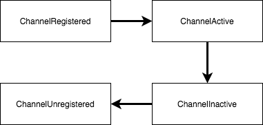

# ChannelHandler와 ChannelPipeline

## 6.1 ChannelHandler 계층

### 6.1.1 Channel 수명주기
Channel인터페이스는 ChannelHandler API와 밀접한 관계가 있으며 간단하지만 유용한 상태 모델을 정의한다.

*Channel 수명주기 상태*
|상태|설명|
|---|---|
|ChannelUnregistered|Channel이 생성됐지만 EventLoop에 등록되지 않음|
|ChannelRegistered|Channel이 EventLoop에 등록됨|
|ChannelActive|Channel이 활성화됨(해당 원격피어로 연결됨). 이제 데이터를 주고받을 수 있음|
|ChannelInactive|Channel이 원격 피어로 연결되지 않음|




## 6.1.2 ChannelHandler 수명주기

다음에는 ChannelHandler 인터페이스에서 제공하는 수명주기 메소드가 나오는데, 이러한 메소드는 ChannelHandler가 ChannelPipeline에 추가 또는 제거된 후 호출된다. 각 메서드는 ChannelHandlerContext 변수를 받는다.

*ChannelHandler 수명주기 메소드*
|메서드|설명|
|---|---|
|handlerAdded|ChannelHandler가 ChannelPipeline에 추가될 때 호출됨|
|handlerRemoved|ChannelHandler가 ChannelPipeline에서 제거될 때 호출됨|
|exceptionCaught|ChannelHandler에서 처리 중에 오류가 발생하면 호출됨|

- ChannelInboundHandler : 모든 유형의 인바운드 데이터와 상태 변경을 처리한다.
- ChannelOutboundHandler :  아웃바운드 데이터를 처리하고 모든 작업의 가로채기를 허용한다.

## 6.1.3 ChannelInboundHandler 인터페이스

아래의 메서드들은 데이터가 수신되거나 연결된 Channel의 상태가 변경될 때 호출된다. 

*ChannelInboundHandler 메서드
|메서드|설명|
|---|---|
|channelRegistered|Channel이 EventLoop에 등록되고 입출력을 처리할 수 있으면 호출됨|
|channelUnRegistered|Channel이 EventLoop에서 등록 해제되고 입출력은ㄹ 처리할 수 없으면 호출됨|
|channelActive|Channel의 연결과 바인딩이 완료되어 활성화되면 호출됨|
|channelInactive|Channel이 활성 상태에서 벗어나 로컬 피어에 대한 연결이 해제되면 호출됨|
|channelReadComplete|CHannel에서 읽기 작업이 완료되면 호출됨|
|channelRead|Channel에서 데이터를 읽을 때 호출됨|
|channelWritabilityChanged|Channel의 기록 가능 상태가 변경되면 호출된다. OutOfMemoryError를 방지하기 위해 너무 빠르게 기록되지 않게 하거나 Channel이 기록 가능한 상태가 되면 기록을 재개할 수 있다. Channel의 isWritable() 메서드를 호출해 해당 채널의 기록 가능 여부를 감지할 수 있다. 기록 가능 여부를 결정하는 임계값은 Channel.config().setWriteHighWaterMark()와 Channel.config().setWriteLowWaterMark()메서드로 설정한다.|
|userEventTriggered|POJO가 ChannelPipeline을 통해 전달돼서 ChannelInboundHandler.fireUserEventTriggered()가 트리거되면 호출됨|

ChannelInboundHandler 구현이 channelRead()를 재정의하는 경우 풀링된 ByteBuf 인스턴스의 메모리를 명시적으로 해제하는 역할을 맡는다. 네티는 다음예제와 같이 메모리를 해제할 수 있는 ReferenceCountUtil.release()를 제공한다.

```
@Sharable
public class DiscardHandler extends ChannelInboundHandlerAdapter {
    @Override
    public void channelRead(ChannelHandlerContext ctx, Object msg)
    {
        ReferenceCountUtil.release(msg);
    }
}
```
네티는 해제되지 않은 리소스를 WARN 수준 로그 메시지로 로깅하므로 코드에 문제가 되는 인스턴스가 있으면 쉽게 발견할 수 있다. 그러나 매번 리소스를 관리하기는 번거로울 수 있으며, SimpleChannelInboundHandler를 이용하면 더 쉽게 리소스를 관리할 수 있다. 

```
@Sharable
public class SimpleDiscardHandler extends SimpleChannelInboundHandler<Object>
{
    @Override
    public void channnelRead0(ChannelHandlerContext ctx, Object msg)
    {
        //다른 조치를 취할 필요가 없음
    }
}
```

SimpleChannelInboundHandler는 리소스를 자동으로 해제하므로 메시지의 참조도 무효화된다. 즉, 메시지의 참조를 저장해 나중에 이용하려고 하면 안 된다.

### 6.1.4 ChannelOutboundHandler 인터페이스

아웃바운드 작업과 데이터는 ChannelOutboundHandler에 의해 처리되며, 여기에 포함된 메서드는 Channel, ChannelPipeline, ChannelHandlerContext에서 이용된다.

ChannelOutboundHandler는 주문식으로 작업이나 이벤트를 지연하는 강력한 기능이 있어 정교하게 요청을 처리할 수 있다. 예를 들어 원격 피어에 대한 기록이 일시 중단된 경우 플러시 작업을 지연하고 나중에 재개할 수 있다.

*ChannelOutboundHandler 메서드*
|메서드|설명|
|---|---|
|bind(ChannelHandlerContext, SocketAddress, ChannelProimse)|Channel을 로컬 주소로 바인딩 요청시 호출됨|
|connect(ChannelHandlerContext, SocketAddres, SocketAddress, ChannelPromise)|Channel을 원격 피어로 연결 요청시 호출됨|
|disconnect(ChannelHandlerContext, ChannelPromise)| Channel을 원격피어로 부터 연결 해제 요청시 호출됨|
|close(ChannelHandlerContext, ChannelPromise)|Channel을 닫는 요청 시 호출됨|
|deregister(ChannelHandlerContext, ChanelPromise)|Channel을 EventLoop에서 등록 해제 요청시 호출됨|
|read(ChannelHandlerContext)|Channel에서 데이터를 읽기 요청 시 호출됨|
|flush(ChannelHandlerContext|Channel을 통해 원격 피어로 큐에 있는 데이터의 플러시 요청시|
|write(ChannelHandlerContext, Object, ChannelPromise)|Channel을 통해 원격 피어로 데이터 기록 요청시 호출됨|

>**ChannelPromise와 ChannelFuture비교**  
ChannelOutboundHandler에 있는 대부분의 메서드에는 작업이 완료되면 알림을 전달받을 ChannelPromise 인수가 있따. ChannelPromise는 ChannelFuture의 하위 인터페이스로서 setSuccess()나 setFailure()같은 기록 가능 메서드를 정의해 ChannelFuture를 읽기 전용으로 만든다.

### 6.1.5 ChannelHandler 어댑터
자신의 ChannelHandler를 작성하는 시작점으로 ChannelInboundHandlerAdapter와 ChannelOutboundHandlerAdapter 클래스를 이용할 수 있다. 이들 어댑터는 각각 ChannelInboundHandler와 ChannelOutboundHandler의 기본 구현을 제공하며, 추상 클래스 ChannelHandlerAdapter를 확장해 공통 상위 인터페이스인 ChannelHandler의 메서드를 받는다.

ChannelHandlerAdapter가 제공하는 유틸리티 메서드인 isSharable()은 구현에 Sharable 어노테이션을 지정해 여러 ChannelPipeline에 추가할 수 있게 한 경우 true를 반환한다.


### 6.1.6 리소스 관리

ChannelInboundHandler.channelRead(), ChannelOutboundHandler.write()를 호출해 데이터를 대상으로 작업할 때는 리소스 누출이 발생하지 않게 주의해야 한다. 네티는 참조 카운팅을 이용해 ByteBuf를 관리한다. 따라서 ByteBuf 이용이 끝난 후에는 참조 카운트를 조정하는 것이 중요하다.

네티는 잠재적인 문제 진단을 돕기 위해 애플리케이션 버퍼 할당의 약 1%를 샘플링해 메모리 누출을 검사하는 ResourceLeakDetector 클래스를 제공한다. 이 작업으로 인한 오버헤드는 아주 작으므로 걱정할 필요는 없다.

네티에는 다음과 같은 누출감지 기준이있다.
|수준|설명|
|---|---|
|DISABLED|누출 감지를 비활성화한다. 이 설정은 포괄적인 테스트를 거친 후에만 이용한다.|
|SIMPLE|기본 샘플링 비율 1%를 이용해 발견된 누출을 보고한다. 기본 샘플링 비율은 대부분의 경우 적합하다.|
|ADVANCED|발견된 누출과 메시지에 접근한 위치를 보고한다. 기본 샘플링 비율을 이용한다.|
|PARANOID|ADVANCED와 비슷하지만 모든 접근을 샘플링한다. 성능에 큰 영향을 미치므로 디버깅 단계에서만 이용해야 한다.|

누출 감지 수준을 정의하려면 다음 자바 시스템 속성을 표에 있는 값 중 하나로 정의한다.
```
java -Dio.netty.leakDetectionLevel=ADVANCED
```

## 6.2 ChannelPipeline 인터페이스
ChannelPipeline을 Channel을 통해 오가는 인바운드와 아웃바운드 이벤트를 가로채는 ChannelHandler 인스턴스의 체인이라고 생각하면, 애플리케이션의 데이터와 이벤트 처리 논리의 핵심을 구성하는 이러한 ChannelHandler의 사옿작용을 쉽게 이해할 수 있다.

새로운 Channel이 생성될 때마다 새로운 ChannelPipelin이 할당된ㄷ. 이 연결은 영구적이며 Channel을 다른 ChannelPipeline과 연결하거나 현재 연결을 해제할 수 없다. 이 과정은 네티 컴포넌트 수명주기의 고정된 작업이므로 개발자가 관여할 필요가 없다.

이벤트는 전달되는 방향을 기준으로 ChannelInboundHandler 또는 ChannelOutboundHandler에 의해 처리되며, ChannelHandlerContext 구현에 대한 호출에 의해 동일한 상위 형식의 다음 핸들러로 전달된다.
> ChannelHandlerContext
ChannelHandler는 ChannelHandlerContext를 이용해 해당 ChannelPipeline및 다른 핸들러와 상호작용할 수 있다. ChannelPipeline의 다음 ChannelHandler에 알림을 전달하는 것은 물론, 속해있는 ChannelPipelien을 동적으로 수정할 수도 있다.
ChannelHandlerContext에는 이벤트를 처리하고 입출력 작업을 수행하는 풍부한 API가 포함돼 있다.

### 6.2.1 ChannelPipeline 수정

ChannelHandler는 다른 ChannelHandler를 추가, 제거 또는 제거하는 방법으로 ChannelPIpeline의 레이아웃을 실시간으로 수정할 수 있따. ChannelPipeline을 수정하는 것은 ChannelHandler의 가장 중요한 기능중 하나이므로 작업 방법을 자세히 확인해 본다.

*ChannelPipeline을 수정하는 ChannelHandler 메서드*
|이름|설명|
|---|---|
|addFirst</br>addLast</br>addAfter</br>addBefore|ChannelHandler를 ChannelPipeline에 추가한다.|
|remove| ChannelHandler를 ChannelPipeline에서 제거한다.|
|replace| Channepipeline내의 ChannelHandler를 다른 ChannelHandler로 대체한다.|

### 6.2.2 이벤트 생성

ChannelPipeline API에는 인바운드와 아웃바운드 작업을 호출하는 추가 메서드가 있다.(너무 많아서 적지 않겠다 ㅠ)

- ChannelPipeline은 한 Channel과 연결된 여러 ChanelHandler를 포함한다.
- 필요에 따라 동적으로 ChannelHandler를 추가하고 제거해 동적으로 ChannelPipeline을 수정할 수 있다.
- ChannelPipeline에는 인바운드와 아웃바운드 이베느에 반응해 작업을 호출하는 풍부한   
API가 있다.

## 6.3 ChannelHandlerContext 인터페이스
ChannelHandlerContext는 ChannelHandler와 ChannelPipelie간의 연결을 나타내며  ChannelHandler를 ChannelPipeline에 추가할 때마다 생성된다. ChannelHandlerContext의 주된 기능은 연결된 ChannelHandler와 동일한 ChannelPipeline내의 다른 ChannelHandler간의 상호작용을 관리하는 것이다.

**유의사항**
- ChannelHandler와 연결된 ChannelHandlerContext는 절대 변경되지 않으므로 참조를 저장해도 괜찮다.
- ChannelHandlerContext 메서드는 이 절의 시작 부분에서 설명했듯이, 다른 클래스에 있는 동일한 이름의 메서드에 비해 이벤트 흐름이 짧다. 이를 잘 활용하면 성능상 이익을 거둘 수 있다.

### 6.3.2 ChannelHandler와 ChannelHandlerContext의 고급 활용

ChannelHandlerContext의 참조를 캐싱하면 ChannelHandler 메서드 외부나 심지어 다른 스레드에서 다른 고급 기법을 실행하는데 이용할 수 있다. 다음 예제에는 이 패턴을 이용해 이벤트를 트리거하는 방법이 나와있다.

```
public class WriteHanlder extends ChannelHandlerAdapter{
    private ChannelHandlerContext ctx;
    @Override
    public void handlerAdded(ChannelHanderContext ctx) {
        this.ctx = ctx; // ChannelHandlerContext의 참조를 나중에 이용하기 위해 캐싱
    }
    public void send(String msg) {
        ctx.writeAndFlush(msg); // 이전에 저장한 ChannelHandlerContext를 이용해 메시지를 전송
    }
}
```

ChannelHandler는 둘 이상의 ChannelPipeline에 속할 수 있으므로 여러 ChannelHandlerContext 인스턴스와 바인딩할 수 있다. ChannelHandler를 이러한 용도로 사용하려면 @Sharable 어노테이션을 지정해야 하며, 그렇지 않고 ChannelPipline에 추가하려 하면 예외가 트리거된다. 여러 동시 채널(즉, 여러 연결)에서 ChannelHandler를 안전하게 이용하려면 ChannelHandler가 스레드에 대해 안전해야 한다.

```
@Sharable
public class SharableHandler extends ChannelInboundHandlerAdapter {
    @Override
    public void channelRead(ChannelHandlerContext ctx, Object msg) {
        System.out.println("Channel read message : " + msg);
        ctx.fireChannelRead(msg);
    }
}
```

ChannelHandler 구현을 여러 파이프라인에 이용하려면 @Sharable 어노테이션을 지정해야 학 상태를 저장하지 않는 두 가지 요건을 충족해야 한다.

> ChannelHandler를 공유하는 이유는?
같은 ChannelHandler를 여러 ChannePipeline에 추가하는 가장 일반적인 이유는 여러 Channel에서 통계 정보를 얻기 위해서이다.

## 6.4 예외처리

### 6.4.1 인바운드 예외 처리
인바운드 이벤트를 처리하는 동안 예외가 발생하면 트리거된 ChannelInboundHandler부터 시작해 예외가 ChannelPipeline을 통과하기 시작한다. 이러한 인바운드 예외를 처리하려면 ChannelInboundHandler 구현에서 다음 메서드를 재정의해야 한다.

public void exceptionCaught(ChannelHandlerContext ctx, Throwable cause) throws Exception;

- ChannelHandler.exceptioCaught()의 기본 구현은 현재 예외를 파이프라인의 다음 핸들러로 전달한다.
- 예외가 파이프라인 끝에 도달하면 예외가 처리되지 않았음을 알리는 항목이 로깅된다.
- 예외가 처리되는 방식을 커스터마이즈하려면 exceptionCaught()를 재정의한다. 예외를 해당 지점 외부로 전파할지 여부는 개발자가 결정할 수 있다.

### 6.4.2 아웃바운드 예외처리
아웃바운드 작업에서 정상적인 완료와 예외를 처리하는 옵션은 다음의 알림 메커니즘에 기반을 둔다.
- 모든 아웃바운드 작업은 ChannelFuture를 반환한다. 작업이 완료되면 ChannelFuture에 등록된 ChannelFutureListener에 성공이나 오류에 대한 알림에 제공된다.
- ChannelOutboundHandler의 거의 모든 메서드에는 ChannelPromise가 전달된다. ChannelFuture의 하위 클래스인 ChannelPromise에도 비동기 알림을 위한 수신기를 할당할 수 있다. 그런데 ChannelPromise에도 즉시 알림을 지원하는 쓰기 가능 메서드가 있다.
    - ChannelPromise setSuccess();
    - ChannelPromise setFailure(Throwable cause);

*ChannelFutureListener를 ChannelFuture에 추가*
```
ChannelFuture future = channel.write(someMessage);
future.addListener(new ChannelFutureListener() {
    @Override
    public void operationComplete(ChannelFuture f) {
        if (!f.isSuccess()) {
            f.cause().printStackTrace();
            f.channel().close();
        }
    }
})
```

*ChannelFutureListener를 ChannelPromise에 추가*
```
public class OutboundExceptionHandler extends ChnnaelOutboundHandlerAdapter {
    @Override
    public void write(ChannelHandlerContext ctx, Object msg, ChannelPromise promise) {
        promise.addListener(new ChannelFutureListener() {
            @Override
            public void operationComplete(ChannelFuture f) {
                if (!f.isSuccess()) {
                    f.cause().printStackTrace();
                    f.channel().close();
                }
            }
        })
    }
}
```
