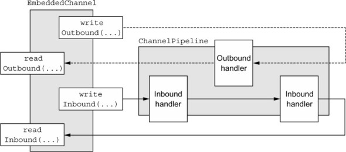

# 단위 테스트

ChannelHandler는 네티 애플리케이션에서 아주 중요한 요소이므로 개발 과정의 표준 단계로서 이를 철저하게 테스트해야 한다. 최상의 방법은 구현이 올바른지만 확인할 것이 아니라 코드를 수정했을 때 문제를 쉽게 식별할 수 있게 테스트를 구성하는 것이다. 이러한 테스트 유형을 단위 테스트라고 한다.

단위 테스트에 대한 통용되는 정의는 없지만 실무에서 인정되는 몇 가지 기본 사항이 있다. 단위 테스트의 기본 개념은 다른 모듈이나 데이터베이스 및 네트워크 등의 런타임 의존성으로부터 최대한으로 격리된 가능한 가장 작은 크기의 코드로 테스트 하는 것이다.  

## EmbeddedChannel의 개요

이전 장인 부트스트랩에서는 ChannelPipeline과 ChannelHandler 구현을 연결해 애플리케이션의 비즈니스 논리를 구성하는 방법을 배웠다. 이러한 설계를 통ㄷ해 복잡한 처리 기능을 각각 잘 정의된 작업이나 단계를 처리하는 작고 재사용 가능한 컴포넌트로 분리할 수 있다. 이번 장에서는 이러한 컴포넌트를 간편하게 테스트하는 방법을 알아본다.

네티는 ChannelHandler를 테스트할 수 있는 embedded transport를 제공한다. 이 전송은 특수한 Channel 구현인 EmbeddedChannel의 기능으로서 이벤트를 파이프라인을 통해 간단하게 전달할 수 있게 해준다.

기본 개념은 간단하다. 인바운드 또는 아웃바운드 데이터를 EmbeddedChannel로 기록하고 ChannelPipeline끝에 도달하는 항목이 있는지 확인하는 것이다. 이렇게 하면 메시지가 인코딩 또는 디코딩됐는지 확인할 수 있고, 트리거된 ChannelHandler 작업이 있는지 여부도 알 수 있다.

*EmbeddedChannel의 주요 메서드*
|이름|역할|
|---|---|
|writeInbound(Object... msgs)|EmbeddedChannel에 인바운드 메시지를 기록한다. EmbeddedChannel에서 readInbound()를 통해 데이터를 읽을 수 있는 경우 true를 반환한다.|
|readInbound()|EmbeddedChannel에서 인바운드 메시지를 읽는다. 반환되는 항목은 전체 ChannelPipeline을 통과한 것이다. 읽을 데이터가 없으면 null을 반환한다.|
|writeOUtbound(Object ... msgs) |EmbeddedCHannel에 아웃바운드 메시지를 기록한다. EmbeddedChannel에서 readOutbound()를 통해 데이터를 읽을 수 있는 경우 true를 반환한다.|
|readOutbound()|EmbeddedChannel에서 아웃바운드 메시지를 읽는다. 반환되는 항목은 전체 ChannelPipeline을 통과한 것이다. 읽을 항목이 없으면 null을 반환한다.|
|finish()|EmbeddedChannel을 완료로 표시하고 전체 인바운드 또는 아웃바운드 데이터를 읽을 수 있는 경우 true를 반환한다. 이 메서드는 EmbeddedChannel의 close()를 호출한다.|

## EmbeddedChannel을 이용한 ChannelHandler 테스트

예제 코드의 작성을 통해  이 부분은 테스트 해본다.

## 예외처리 테스트
애플리케이션은 일반적으로 데이터 변환 외에도 다양한 작업을 수행한다. 예를 들어, 입력이 잘못되거나 데이터가 너무 많은 경우 적절하게 처리해야 한다. 책에 나온대로 TooLongFrameException을 발생시키고 처리하는 방법을 따라해 보도록 한다.

## 요약
JUnit과 같은 테스트 도구를 이용한 단위 테스트는 코드의 정확성을 보장하고 유지고나리성을 개선하는 효과적인 방법이다. 이번 장에서는 네티가 제공하는 테스트 도구를 이용해 자신의 커스텀 ChannelHandler를 테스트하는 방법을 배웠다.

다음장에서는 네티를 이용해 실제 애플리케이션을 작성하는데 집중한다. 이후에는 더 이상 테스트코드 예제를 설명하지 않으므로 여기에 있는 방법을 확실히 익히라고 한다.